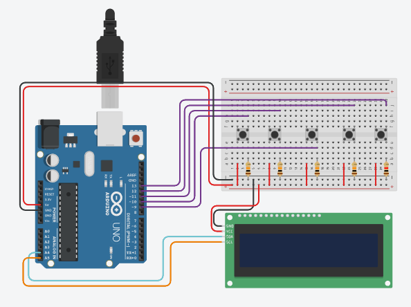

# Pong com Arduino

Este projeto implementa uma versão do clássico jogo Pong usando um Arduino e uma tela LCD. Os jogadores controlam as barras para evitar que a bola passe e tentam marcar pontos. O jogo é projetado para dois jogadores e possui opções de dificuldade.

## Componentes Necessários

- **Arduino Uno**
- **LCD I2C (20x4)**
- **Botões (5 unidades)**
  - 2 para o jogador 1 (cima e baixo)
  - 2 para o jogador 2 (cima e baixo)
  - 1 para iniciar o jogo
- **Fios de conexão**
- **Resistores**

## Montagem

### Circuito

- Conecte o LCD I2C ao Arduino nas portas corretas.
- Conecte os botões aos pinos digitais do Arduino conforme especificado no código.
- **Diagrama de circuito**:
  
  
### Instruções de Uso

1. **Conexão**: Verifique se todos os componentes estão conectados corretamente ao Arduino.
2. **Upload do Código**: Carregue o código no Arduino usando a IDE Arduino.
3. **Iniciar o Jogo**: Pressione o botão "Iniciar" para começar o jogo.
4. **Controle**: Use os botões para mover as barras dos jogadores. O objetivo é evitar que a bola passe pela sua barra e tentar marcar pontos no adversário.

## Funcionalidades

- **Dificuldade**: Os jogadores podem escolher entre duas dificuldades (Fácil e Difícil).
- **Pontuação**: O jogo termina quando um jogador alcança 5 pontos.
- **Feedback Visual**: O LCD exibe os pontos e mensagens durante o jogo.

## Créditos
Este projeto foi desenvolvido por:

<table>
  <tr>
    <td align="center">
      <a href="https://github.com/nicolassm145">
         
        
<strong>Nícolas de Souza</strong>

      </a>
    </td>
    <td align="center">
      <a href="https://github.com/flp-gregorio">
         
        
<strong>Felipe Alves Gregorio</strong>

      </a>
    </td>
  </tr>
</table>

## Considerações Finais

Este projeto é uma ótima maneira de aprender sobre programação em C++ para Arduino, interação com hardware e lógica de jogos. Sinta-se à vontade para modificar e melhorar o jogo conforme sua criatividade!

---
